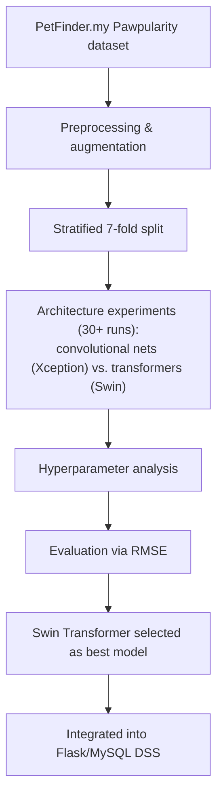
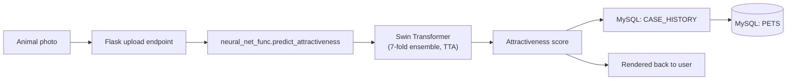

# 🐾 AI Pawpularity Decision Support System

### Master's Diploma · Artificial Intelligence · Computer Vision · 2022

A decision support system (DSS) that predicts the visual attractiveness ("pawpularity") of
shelter animals from photographs, built as a Master's qualification work at Taras Shevchenko
National University of Kyiv. The research compares convolutional networks and transformer
architectures, selects a **Swin Transformer** as the best-performing model, and implements
the result as a Flask + MySQL web application.

Official Ukrainian thesis title: **«Розробка та дослідження інтелектуальної технології
визначення привабливості тварин із притулку»**

> 🕰️ **Historical project notice.** This repository preserves a 2022 Master's research
> project as a portfolio/academic archive. The web application dependencies, APIs, and ML
> tooling reflect the original 2022 research period. Selected repository-level changes
> (security sanitization, documentation) were made later; the original algorithmic behaviour
> was not modernized. See [`docs/legacy-notes.md`](docs/legacy-notes.md).

> ⚠️ **Migration in progress.** The final thesis PDF, the Kaggle training notebook, and the
> Flask HTML template are now included below. Diagrams, defence materials, the database
> schema, and academic supporting documents are verified in the source archive but not yet
> transferred — see [`docs/artefact-index.md`](docs/artefact-index.md) for the full status of
> every artefact.

## 🧭 Quick navigation

| Section | What's inside |
|---|---|
| [🎯 Project at a glance](#-project-at-a-glance) | Verified facts about the work |
| [💡 The problem](#-the-problem) | Why shelter-animal photography matters |
| [🎯 Research goal](#-research-goal) | Official framing from the thesis |
| [🔬 Research pipeline](#-research-pipeline) | Experimental approach |
| [🏗 Architecture](#-architecture) | System design |
| [🏆 Selected model](#-selected-model--swin-transformer) | Swin Transformer + inference |
| [🖥 Web application](#-web-application) | Flask/MySQL DSS |
| [📓 Kaggle notebook](#-kaggle-notebook) | Original Swin Transformer training notebook |
| [🎓 Academic work](#-academic-work) | Thesis, conference, approbation |
| [📊 Thesis facts](#-thesis-facts) | Page/table/figure counts |
| [🛠 Setup](#-setup--reproducibility) | What actually runs today |

## 🎯 Project at a glance

|  |  |
|---|---|
| 🎓 Degree | Master's (MSc), Artificial Intelligence Technologies programme |
| 🏫 Institution | Taras Shevchenko National University of Kyiv, Faculty of Information Technology, Dept. of Intelligent Technologies |
| 🧠 Task | Predicting shelter-animal photo attractiveness ("pawpularity") |
| 🏆 Selected architecture | Swin Transformer (`swin_large_patch4_window7_224`) |
| 🖼 Dataset context | PetFinder.my – Pawpularity Contest (Kaggle, 23.IX.2021–14.I.2022) |
| 🧪 ML stack | Python, fastai, timm, scikit-learn |
| 🌐 Application | Flask (HTML/CSS/JS) |
| 🗄 Database | MySQL |
| 📅 Year | 2022 |
| 👤 Author | Maryna Antonevych (Антоневич М. М.) |
| 🧑‍🏫 Supervisor | Snytiuk V. Ye. (Снитюк В. Є.), Dr. Sc. (Tech.), Professor |

## 💡 The problem

Homeless and shelter animals are a recurring challenge worldwide. According to the thesis,
animals with higher-quality photographs on a shelter's website tend to attract more interest
from potential adopters and find homes faster — but shelter websites are typically not
equipped with any intelligent technology to help predict or improve photo attractiveness
before publishing. This project investigates whether a neural-network-based technology can
predict that attractiveness from a photo, to help shelter staff select and improve the images
they publish. (This is a decision-support tool for shelter staff, not a claim that it
guarantees any adopted animal an outcome.)

## 🎯 Research goal

From the thesis abstract:

- **Goal:** development of models of structural and parametric optimization of neural
  network technology to determine the attractiveness of animals from the shelter.
- **Object of study:** the processes of evaluating the attractiveness of animals from the
  shelter using artificial intelligence technologies.
- **Subject of study:** the intelligent technology for determining the attractiveness of
  animals from the shelter using neural networks.

The work spans three layers: (1) neural-network **research** (architecture comparison,
hyperparameter analysis), (2) the **selected ML model** used for inference, and (3) a
**DSS/web implementation** that makes the model usable by shelter staff.

## 🔬 Research pipeline



Per the thesis conclusions, more than 30 experiments were run comparing convolutional neural
networks (Xception) against transformer architectures (Swin Transformer); Swin Transformer
produced better final results than the convolutional baselines. Exact per-experiment
RMSE/ranking tables are in the thesis (see [Thesis facts](#-thesis-facts)) and have not yet
been re-transcribed into this repository — no specific numeric results are claimed here
beyond what is stated above, to avoid inventing figures that were not independently verified
in this session.

## 🏗 Architecture



This reflects the actual code in [`src/webapp/app.py`](src/webapp/app.py) and
[`src/webapp/neural_net_func.py`](src/webapp/neural_net_func.py): an uploaded image is saved
temporarily, scored by `predict_attractiveness`, the result is written to a `CASE_HISTORY`
table alongside the selected `PETS` record, and the temporary image file is deleted.

## 🏆 Selected model — Swin Transformer

The inference implementation in `neural_net_func.py` confirms the following verified
technical details:

- Base model: `swin_large_patch4_window7_224` (via `timm.create_model`, `pretrained=True`).
- Training/inference harness: fastai `Learner`, `BCEWithLogitsLossFlat` loss, custom `rmse`
  metric (the same RMSE formula used by the PetFinder.my Kaggle competition).
- **Stratified 7-fold cross-validation** (`StratifiedKFold`, `N_FOLDS = 7`), with per-fold
  model checkpoints (`model_fold_0` … `model_fold_6`).
- **Test-time augmentation** (`learn.tta(..., n=5, beta=0)`) and fold-averaged predictions.
- Data augmentation: brightness, contrast, hue, saturation (`setup_aug_tfms`).
- Output scaled to a 0–100 pawpularity score.

## 🖥 Web application

A Flask application (`src/webapp/app.py`) exposes:

- `GET /index.html` — shows the animal list (from MySQL `PETS`) and upload form.
- `POST /index.html` — accepts an uploaded photo + selected pet + description, runs the
  Swin Transformer prediction, stores the result in `CASE_HISTORY`, and flashes the score
  back to the user.
- `GET /getCaseHistoryCSV`, `GET /getPetsInfoCSV` — CSV export endpoints for the two tables.

The [`templates/index.html`](src/webapp/templates/index.html) template is included; the
`static/` assets it references (CSS/JS/images) exist in the source Drive archive and are
tracked as pending migration — see [`docs/artefact-index.md`](docs/artefact-index.md).

## 🗄 Database

The application connects to a MySQL database (`database_func.py`) with two tables referenced
directly in the application code: `PETS` and `CASE_HISTORY` (the latter storing
`case_datetime`, `prediction_result`, `case_info`, and a `PETS_pet_id` foreign key). The full
schema / ER diagram / `.mwb` file exist in the source archive and are pending migration.

## 📓 Kaggle notebook

The original training notebook, [`notebooks/pawpularity_swin_transformer.ipynb`](notebooks/pawpularity_swin_transformer.ipynb)
(source: `fork-of-my-fork-of-pawpularity-swin-transformer.ipynb`), is included unmodified from
the PetFinder.my – Pawpularity Contest submission. It trains the Swin Transformer ensemble
described above. It is preserved as-is for provenance; running it today would require the
original Kaggle GPU environment, the competition dataset, and the 2021/2022-era package
versions (fastai, timm), none of which are bundled in this repository.

## 🎓 Academic work

| Artefact | Description | Status |
|---|---|---|
| 📕 Master's Thesis (final, v14) | 161 pages | [`thesis/final/Антоневич_диплом_6_курс_2022_v14.pdf`](thesis/final/Антоневич_диплом_6_курс_2022_v14.pdf) |
| 🎤 Defence presentation & speech | `2_defence/` | Pending migration |
| 📄 Conference thesis | *"Development and Research of the Intelligent Technology for Predicting the Popularity of Animals From the Shelter"*, VIII International Scientific and Practical Conference "Information Technology and Implementation" (Satellite), 2021 | Pending migration |
| ✅ Implementation certificate | From the Cherkasy City Society for the Protection of Animals "Друг" (Friend) | Pending migration |
| 📝 Supervisor review / reviewer report | `7_vidguk_kerivnyka/`, `8_retsenziia/` | Pending migration |

### 🇺🇦 Короткий опис українською

Це кваліфікаційна робота магістра з розробки та дослідження інтелектуальної технології
визначення привабливості тварин із притулку за фотографією. У результаті дослідження понад
30 експериментів порівняно згорткові нейронні мережі (Xception) та трансформери, обрано
Swin Transformer як найкращу модель. Реалізовано систему підтримки прийняття рішень (СППР) у
вигляді веб-додатку (Flask, MySQL). Роботу апробовано через довідку про впровадження від
Черкаського міського товариства захисту тварин "Друг" та доповідь на VIII Міжнародній
науково-практичній конференції IT&I (Satellite) 2021.

## 📊 Thesis facts

Verified directly from the final thesis PDF (`Антоневич_диплом_6_курс_2022_v14.pdf`):

| Metric | Value |
|---|---|
| Pages | 161 |
| Principal chapters | 3 |
| References | 93 |
| Tables | 12 |
| Figures | 113 |
| Appendices | 8 |

## 🛠 Setup / reproducibility

**What is verified in this repository today:**

- `src/webapp/app.py`, `database_func.py`, and `neural_net_func.py` are syntactically valid
  Python 3 (`python3 -m py_compile` passes) and are sanitized of historical credentials.

**What is *not* verified to run today, and why:**

- The Flask app's `templates/index.html` is included, but the `static/` assets it references
  (CSS/JS/images) are not yet present in this repository (pending migration — see
  [`docs/artefact-index.md`](docs/artefact-index.md)).
- `neural_net_func.py` depends on `fastai`, `timm`, and pre-trained fold checkpoints
  (`model_fold_0` … `model_fold_6`) plus the PetFinder.my dataset layout under
  `static/dataset/petfinder-pawpularity-score/`, none of which are bundled here. The original
  competition dataset is third-party and is not redistributed in this repository; see the
  [PetFinder.my Pawpularity Contest](https://www.kaggle.com/c/petfinder-pawpularity-score) on
  Kaggle.
- No `requirements.txt` with pinned 2022-era dependency versions has been reconstructed yet.

This repository should currently be treated as a **source-code and research archive**, not a
one-command runnable application.

## 🔐 Configuration

Copy [`.env.example`](.env.example) to `.env` and fill in real values. Required variables:

```env
FLASK_SECRET_KEY=...
MYSQL_HOST=...
MYSQL_DATABASE=...
MYSQL_USER=...
MYSQL_PASSWORD=...
```

`.env` is git-ignored. No historical credential values are present anywhere in this
repository or its Git history — see [`docs/legacy-notes.md`](docs/legacy-notes.md) for the
exact sanitization applied.

## 🌳 Repository map

```text
masters_diploma_2022/
├── README.md
├── .gitignore
├── .env.example
├── src/
│   └── webapp/
│       ├── app.py
│       ├── database_func.py
│       ├── neural_net_func.py
│       └── templates/
│           └── index.html
├── notebooks/
│   └── pawpularity_swin_transformer.ipynb
├── thesis/
│   └── final/
│       └── Антоневич_диплом_6_курс_2022_v14.pdf
└── docs/
    ├── legacy-notes.md
    └── artefact-index.md
```

## 📜 Citation

If you reference this work academically, please cite it by its official Ukrainian title:

> Антоневич М. М. Розробка та дослідження інтелектуальної технології визначення привабливості
> тварин із притулку : кваліфікаційна робота магістра : 122 Комп'ютерні науки / наук. керівник
> Снитюк В. Є. — Київ : Київський національний університет імені Тараса Шевченка, 2022. — 161 с.
