# 🐾 AI Pawpularity Decision Support System

### Master's Diploma · Artificial Intelligence · Computer Vision · 2022

A decision support system (DSS) that predicts the visual attractiveness ("pawpularity") of
shelter animals from photographs, built as a Master's qualification work at Taras Shevchenko
National University of Kyiv. The research compares convolutional networks and transformer
architectures, selects a **Swin Transformer** as the best-performing model, and implements
the result as a Flask + MySQL web application.

Official Ukrainian thesis title: **«Розробка та дослідження інтелектуальної технології
визначення привабливості тварин із притулку»**

> 🕰️ **Historical project notice.** This repository preserves a 2022 Master's research
> project as a portfolio/academic archive. The web application dependencies, APIs, and ML
> tooling reflect the original 2022 research period. Selected repository-level changes
> (security sanitization, documentation) were made later; the original algorithmic behaviour
> was not modernized. See [`docs/legacy-notes.md`](docs/legacy-notes.md).

This archive includes the final thesis, Kaggle notebook, sanitized Flask source (including
CSS/JS), database schema and ER diagram, defence presentation and speech, the conference
thesis, the implementation certificate, and the supervisor/reviewer reports. A small number of
items remain intentionally excluded (third-party template icons/stock photography, the full
Kaggle dataset, trained model checkpoints, and multi-GB video recordings) — see
[`docs/artefact-index.md`](docs/artefact-index.md) for the complete, itemized status.

## 🖼 Project preview

<p align="center">
  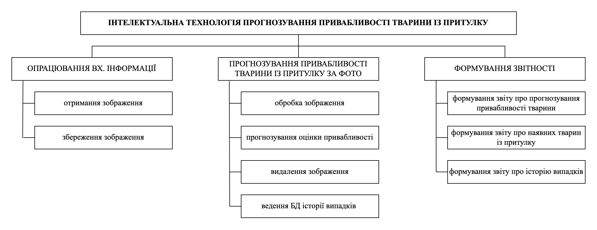<br>
  <em>Overall project structure</em>
</p>

<p align="center">
  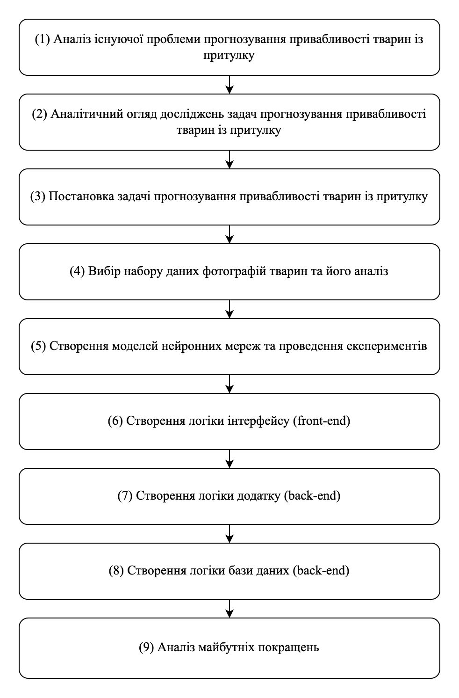
  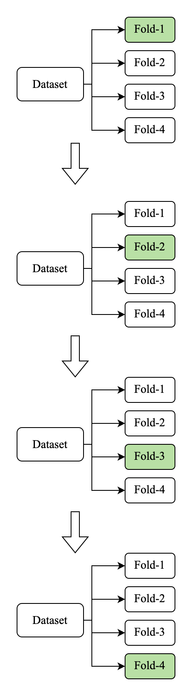
</p>
<p align="center"><em>Research methodology (left) and stratified K-fold cross-validation (right)</em></p>

<p align="center">
  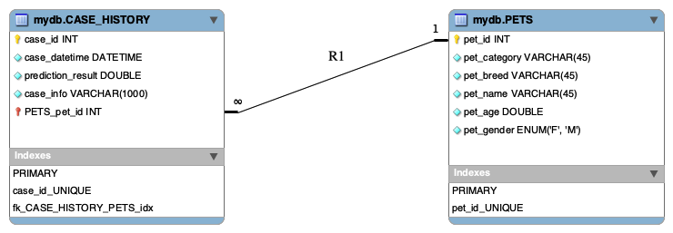<br>
  <em>Database ER diagram (PETS / CASE_HISTORY)</em>
</p>

## 🧭 Quick navigation

| Section | What's inside |
|---|---|
| [🎯 Project at a glance](#-project-at-a-glance) | Verified facts about the work |
| [💡 The problem](#-the-problem) | Why shelter-animal photography matters |
| [🎯 Research goal](#-research-goal) | Official framing from the thesis |
| [🔬 Research pipeline](#-research-pipeline) | Experimental approach |
| [🏗 Architecture](#-architecture) | System design |
| [🏆 Selected model](#-selected-model--swin-transformer) | Swin Transformer + inference |
| [🖥 Web application](#-web-application) | Flask/MySQL DSS |
| [📓 Kaggle notebook](#-kaggle-notebook) | Original Swin Transformer training notebook |
| [🎓 Academic work](#-academic-work) | Thesis, conference, approbation |
| [📊 Thesis facts](#-thesis-facts) | Page/table/figure counts |
| [🛠 Setup](#-setup--reproducibility) | What actually runs today |

## 🎯 Project at a glance

|  |  |
|---|---|
| 🎓 Degree | Master's (MSc), Artificial Intelligence Technologies programme |
| 🏫 Institution | Taras Shevchenko National University of Kyiv, Faculty of Information Technology, Dept. of Intelligent Technologies |
| 🧠 Task | Predicting shelter-animal photo attractiveness ("pawpularity") |
| 🏆 Selected architecture | Swin Transformer (`swin_large_patch4_window7_224`) |
| 🖼 Dataset context | PetFinder.my – Pawpularity Contest (Kaggle, 23.IX.2021–14.I.2022) |
| 🧪 ML stack | Python, fastai, timm, scikit-learn |
| 🌐 Application | Flask (HTML/CSS/JS) |
| 🗄 Database | MySQL |
| 📅 Year | 2022 |
| 👤 Author | Maryna Antonevych (Антоневич М. М.) |
| 🧑‍🏫 Supervisor | Snytiuk V. Ye. (Снитюк В. Є.), Dr. Sc. (Tech.), Professor |

## 💡 The problem

Homeless and shelter animals are a recurring challenge worldwide. According to the thesis,
animals with higher-quality photographs on a shelter's website tend to attract more interest
from potential adopters and find homes faster — but shelter websites are typically not
equipped with any intelligent technology to help predict or improve photo attractiveness
before publishing. This project investigates whether a neural-network-based technology can
predict that attractiveness from a photo, to help shelter staff select and improve the images
they publish. (This is a decision-support tool for shelter staff, not a claim that it
guarantees any adopted animal an outcome.)

## 🎯 Research goal

From the thesis abstract:

- **Goal:** development of models of structural and parametric optimization of neural
  network technology to determine the attractiveness of animals from the shelter.
- **Object of study:** the processes of evaluating the attractiveness of animals from the
  shelter using artificial intelligence technologies.
- **Subject of study:** the intelligent technology for determining the attractiveness of
  animals from the shelter using neural networks.

The work spans three layers: (1) neural-network **research** (architecture comparison,
hyperparameter analysis), (2) the **selected ML model** used for inference, and (3) a
**DSS/web implementation** that makes the model usable by shelter staff.

## 🔬 Research pipeline

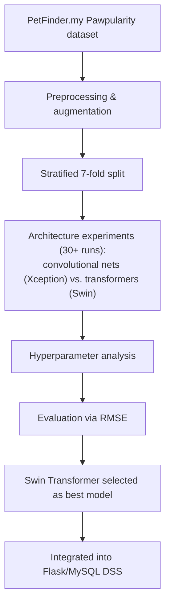

Per the thesis conclusions, more than 30 experiments were run comparing convolutional neural
networks (Xception) against transformer architectures (Swin Transformer). The defence
presentation includes a summary table for the six representative models that were carried
through to final comparison — reproduced here exactly as presented (RMSE, lower is better):

| Model | Type | Library | Runtime (GPU) | Private Score | Public Score |
|---|---|---|---|---|---|
| Model-4 | Custom convolutional | tensorflow.keras | 4664.8s | 21.95402 | 21.94387 |
| Model-6 | Xception | tensorflow.keras | 3141.3s | 24.04538 | 24.01819 |
| Model-11 | Xception | tensorflow.keras | 2539.1s | 20.51204 | 20.50848 |
| Model-18 | Swin Transformer | fastai | 17911.1s | 17.16304 | 17.80600 |
| Model-22 | Swin Transformer | fastai | 20498.9s | 17.11781 | 17.83321 |
| **Model-34** (selected) | **Swin Transformer** | fastai | 20217.6s | **17.08097** | 17.90201 |

**Model-34** — the Swin Transformer configuration with the best Private Score — was the one
integrated into the web application. Convolutional networks (both the custom architecture and
Xception) consistently scored worse than every Swin Transformer run.

<p align="center">
  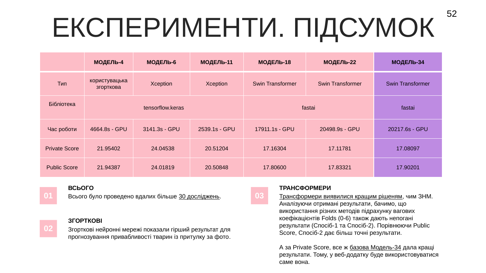
</p>
<p align="center"><em>Original summary slide from the defence presentation (source for the table above).</em></p>

<p align="center">
  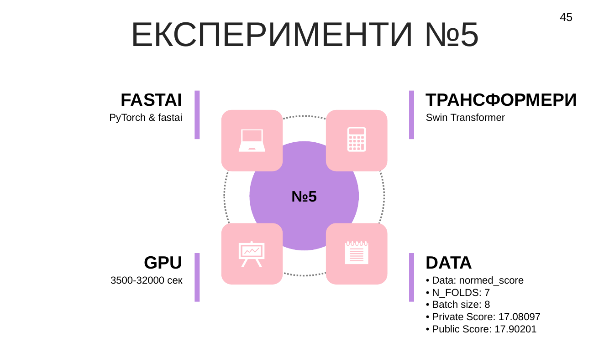
</p>
<p align="center"><em>Experiment #5 (Swin Transformer, 7-fold CV) — one individual experiment slide, for detail.</em></p>

## 🏗 Architecture

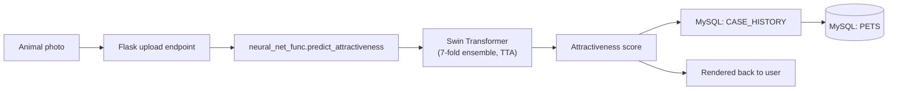

This reflects the actual code in [`src/webapp/app.py`](src/webapp/app.py) and
[`src/webapp/neural_net_func.py`](src/webapp/neural_net_func.py): an uploaded image is saved
temporarily, scored by `predict_attractiveness`, the result is written to a `CASE_HISTORY`
table alongside the selected `PETS` record, and the temporary image file is deleted.

<p align="center">
  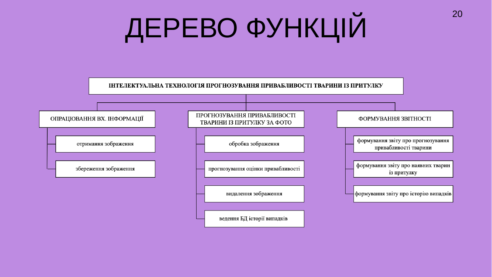<br>
  <em>Function tree: input processing, attractiveness prediction, and reporting</em>
</p>

## 🏆 Selected model — Swin Transformer

The inference implementation in `neural_net_func.py` confirms the following verified
technical details:

- Base model: `swin_large_patch4_window7_224` (via `timm.create_model`, `pretrained=True`).
- Training/inference harness: fastai `Learner`, `BCEWithLogitsLossFlat` loss, custom `rmse`
  metric (the same RMSE formula used by the PetFinder.my Kaggle competition).
- **Stratified 7-fold cross-validation** (`StratifiedKFold`, `N_FOLDS = 7`), with per-fold
  model checkpoints (`model_fold_0` … `model_fold_6`).
- **Test-time augmentation** (`learn.tta(..., n=5, beta=0)`) and fold-averaged predictions.
- Data augmentation: brightness, contrast, hue, saturation (`setup_aug_tfms`).
- Output scaled to a 0–100 pawpularity score.

## 🖥 Web application

<p align="center">
  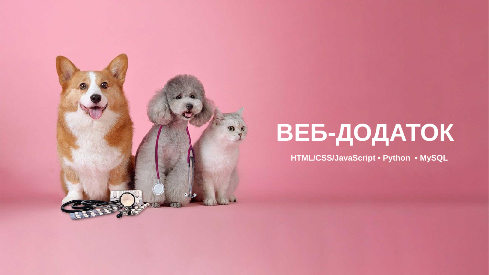
</p>

A Flask application (`src/webapp/app.py`) exposes:

- `GET /index.html` — shows the animal list (from MySQL `PETS`) and upload form.
- `POST /index.html` — accepts an uploaded photo + selected pet + description, runs the
  Swin Transformer prediction, stores the result in `CASE_HISTORY`, and flashes the score
  back to the user.
- `GET /getCaseHistoryCSV`, `GET /getPetsInfoCSV` — CSV export endpoints for the two tables.

The [`templates/index.html`](src/webapp/templates/index.html) template is included, along
with the real [`static/css/style.css`](src/webapp/static/css/style.css) and
[`static/js/`](src/webapp/static/js/) it references. The `static/images/` assets are
intentionally excluded — they include third-party brand logos (Facebook, Instagram, Kaggle)
from the HTML template this site was built on, whose redistribution rights are unclear; see
[`docs/artefact-index.md`](docs/artefact-index.md).

<details>
<summary><strong>🖼 Web application screenshots (from the defence presentation)</strong></summary>
<br>

<p align="center">
  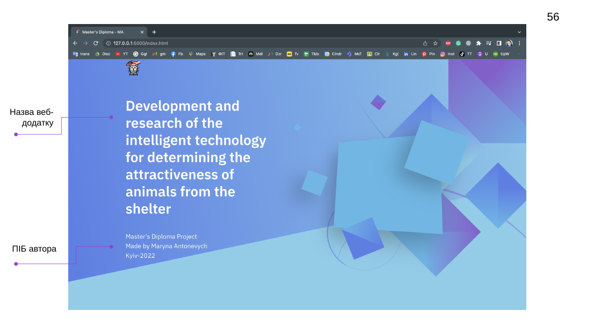<br>
  <em>Landing screen</em>
</p>

<p align="center">
  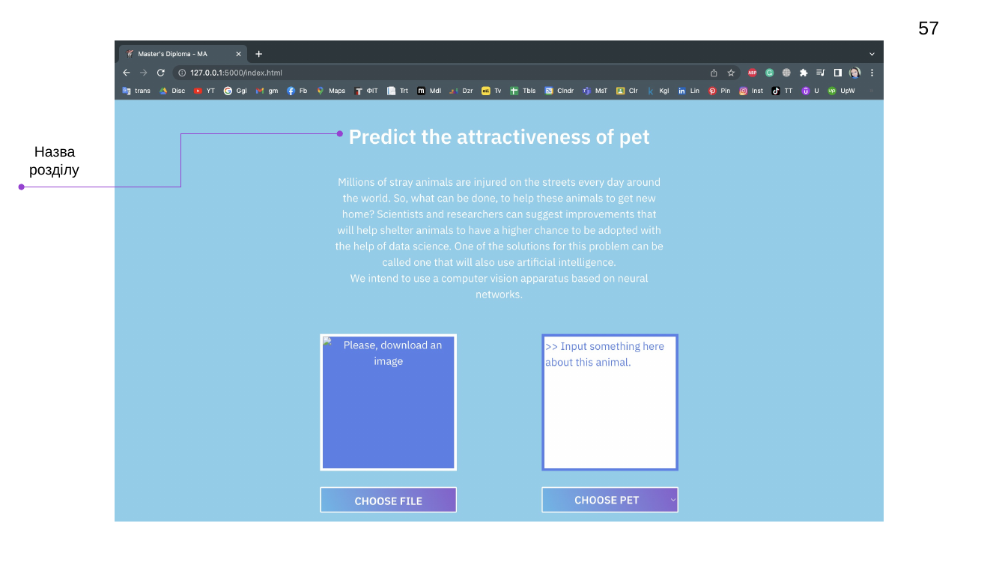<br>
  <em>"Predict the attractiveness of pet" section</em>
</p>

<p align="center">
  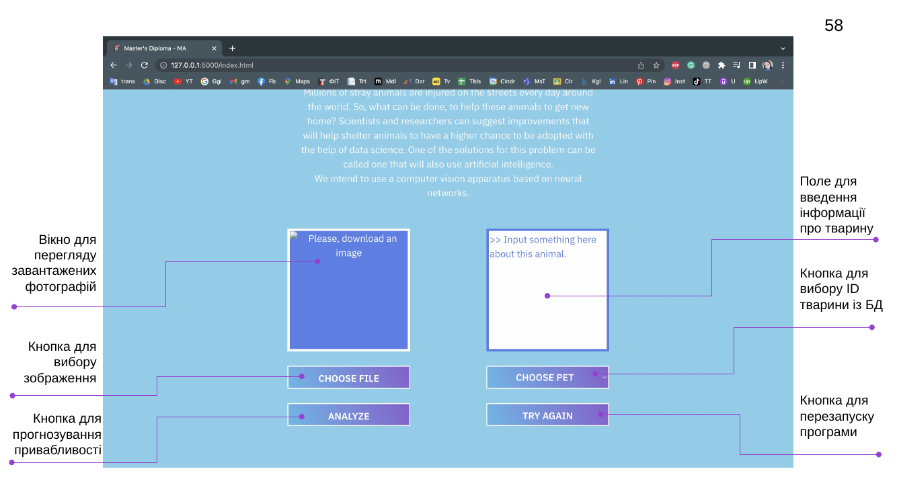<br>
  <em>Photo upload and pet-selection UI (annotated)</em>
</p>

<p align="center">
  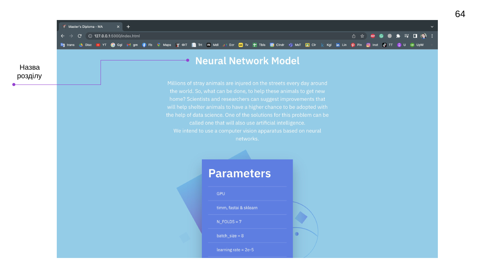<br>
  <em>Model parameters shown in the app (GPU, timm/fastai/sklearn, N_FOLDS=7, batch_size=8, learning rate=2e-5)</em>
</p>

<p align="center">
  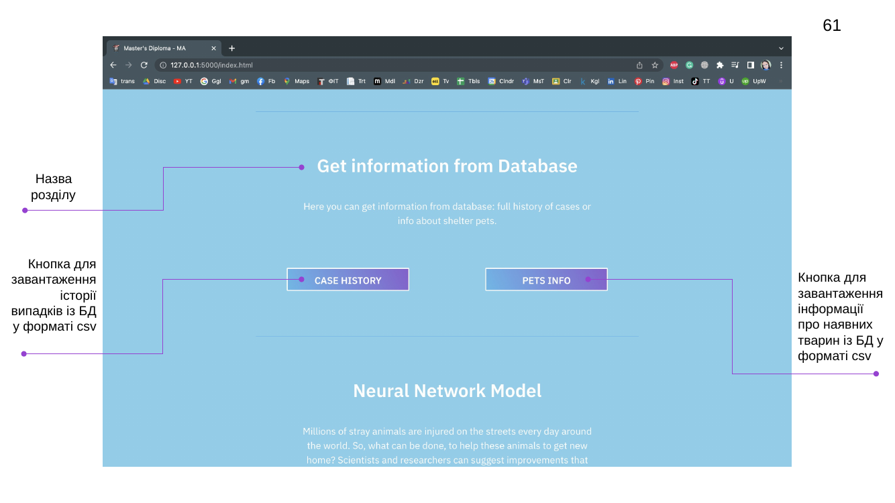<br>
  <em>Database export UI (case history / pets info as CSV, annotated)</em>
</p>

<p align="center">
  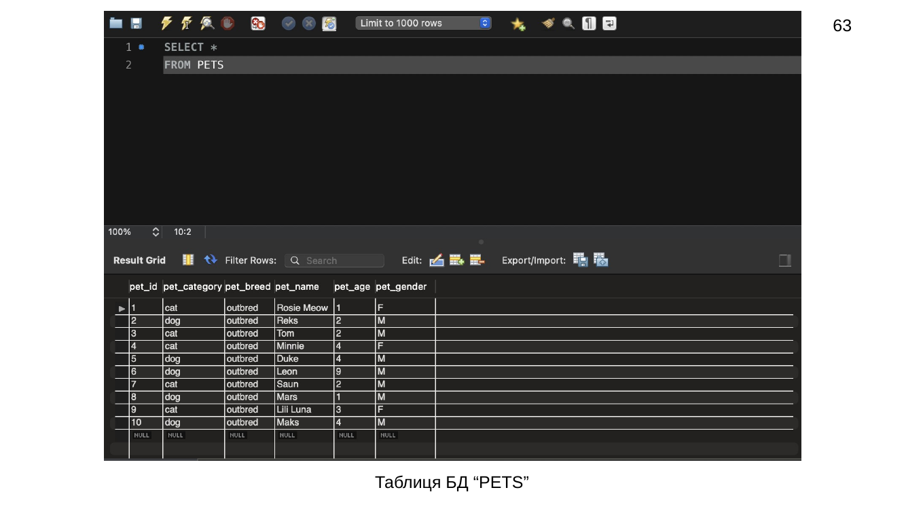<br>
  <em>MySQL PETS table (matches <a href="database/sample_data/pets_data.csv">database/sample_data/pets_data.csv</a>)</em>
</p>

<p align="center">
  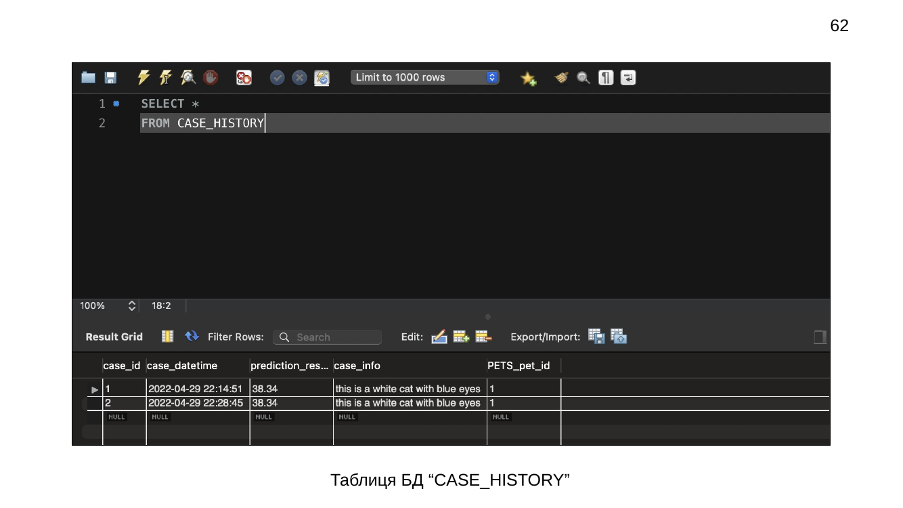<br>
  <em>MySQL CASE_HISTORY table showing an actual stored prediction (score 38.34)</em>
</p>

<p align="center">
  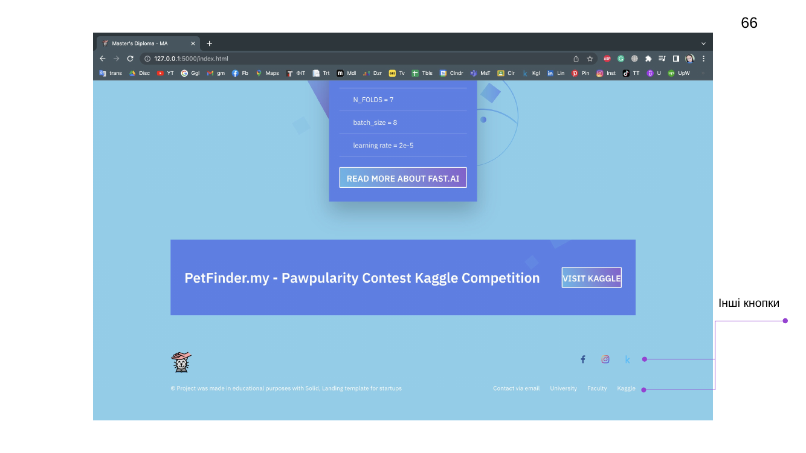<br>
  <em>Footer with attribution and contact links</em>
</p>

</details>

## 🗄 Database

The application connects to a MySQL database (`database_func.py`) with two tables referenced
directly in the application code: `PETS` and `CASE_HISTORY` (the latter storing
`case_datetime`, `prediction_result`, `case_info`, and a `PETS_pet_id` foreign key).

The real schema and ER diagram are included:

- [`database/schema/Antonevych_database_diploma_6_kurs.mwb`](database/schema/Antonevych_database_diploma_6_kurs.mwb) — MySQL Workbench model
- [`database/diagrams/ERR_diagram_diploma_6_kurs_2.png`](database/diagrams/ERR_diagram_diploma_6_kurs_2.png) — ER diagram
- [`database/sample_data/pets_data.csv`](database/sample_data/pets_data.csv) — small project-owned sample of `PETS` rows (test data, no real shelter records)

## 📓 Kaggle notebook

The original training notebook, [`notebooks/pawpularity_swin_transformer.ipynb`](notebooks/pawpularity_swin_transformer.ipynb)
(source: `fork-of-my-fork-of-pawpularity-swin-transformer.ipynb`), is included unmodified from
the PetFinder.my – Pawpularity Contest submission. It trains the Swin Transformer ensemble
described above. It is preserved as-is for provenance; running it today would require the
original Kaggle GPU environment, the competition dataset, and the 2021/2022-era package
versions (fastai, timm), none of which are bundled in this repository.

## 🎓 Academic work

| Artefact | Description | Status |
|---|---|---|
| 📕 Master's Thesis (final, v14) | 161 pages | [`thesis/final/Антоневич_диплом_6_курс_2022_v14.pdf`](thesis/final/Антоневич_диплом_6_курс_2022_v14.pdf) |
| 🎤 Defence presentation | Final defence slides (v3) | [`defence/presentation/Антоневич_презентація_диплом_6_курс_2022_v3.pptx`](defence/presentation/Антоневич_презентація_диплом_6_курс_2022_v3.pptx) |
| 🗣 Defence speech | Presentation script | [`defence/speech/Антоневич_текст_доповіді_диплом_6_курс_2022.pdf`](defence/speech/Антоневич_текст_доповіді_диплом_6_курс_2022.pdf) |
| 📄 Conference thesis | *"Development and Research of the Intelligent Technology for Predicting the Popularity of Animals From the Shelter"*, VIII International Scientific and Practical Conference "Information Technology and Implementation" (Satellite), 2021 | [`publications/conference/Антоневич_тези_диплом_6_курс_2022.pdf`](publications/conference/Антоневич_тези_диплом_6_курс_2022.pdf) |
| ✅ Implementation certificate | From the Cherkasy City Society for the Protection of Animals "Друг" (Friend) | [`academic/implementation-certificate/`](academic/implementation-certificate/) |
| 📝 Supervisor review | Снитюк В. Є. | [`academic/supervisor-review/`](academic/supervisor-review/) |
| 📝 Reviewer report | | [`academic/reviewer-report/`](academic/reviewer-report/) |

<p align="center">
  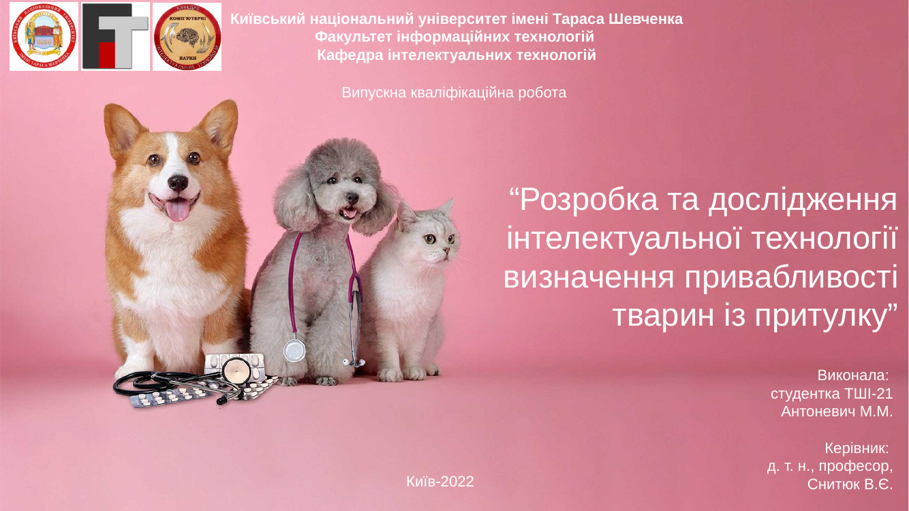
</p>

### 🇺🇦 Короткий опис українською

Це кваліфікаційна робота магістра з розробки та дослідження інтелектуальної технології
визначення привабливості тварин із притулку за фотографією. У результаті дослідження понад
30 експериментів порівняно згорткові нейронні мережі (Xception) та трансформери, обрано
Swin Transformer як найкращу модель. Реалізовано систему підтримки прийняття рішень (СППР) у
вигляді веб-додатку (Flask, MySQL). Роботу апробовано через довідку про впровадження від
Черкаського міського товариства захисту тварин "Друг" та доповідь на VIII Міжнародній
науково-практичній конференції IT&I (Satellite) 2021.

## 📊 Thesis facts

Verified directly from the final thesis PDF (`Антоневич_диплом_6_курс_2022_v14.pdf`):

| Metric | Value |
|---|---|
| Pages | 161 |
| Principal chapters | 3 |
| References | 93 |
| Tables | 12 |
| Figures | 113 |
| Appendices | 8 |

## 🛠 Setup / reproducibility

**What is verified in this repository today:**

- `src/webapp/app.py`, `database_func.py`, and `neural_net_func.py` are syntactically valid
  Python 3 (`python3 -m py_compile` passes) and are sanitized of historical credentials.

**What is *not* verified to run today, and why:**

- `static/images/` (third-party template icons/logos) is intentionally excluded — see
  [`docs/artefact-index.md`](docs/artefact-index.md).
- `neural_net_func.py` depends on `fastai`, `timm`, and pre-trained fold checkpoints
  (`model_fold_0` … `model_fold_6`) plus the PetFinder.my dataset layout under
  `static/dataset/petfinder-pawpularity-score/`, none of which are bundled here. The original
  competition dataset is third-party and is not redistributed in this repository; see the
  [PetFinder.my Pawpularity Contest](https://www.kaggle.com/c/petfinder-pawpularity-score) on
  Kaggle.
- No `requirements.txt` with pinned 2022-era dependency versions has been reconstructed yet.

This repository should currently be treated as a **source-code and research archive**, not a
one-command runnable application.

## 🔐 Configuration

Copy [`.env.example`](.env.example) to `.env` and fill in real values. Required variables:

```env
FLASK_SECRET_KEY=...
MYSQL_HOST=...
MYSQL_DATABASE=...
MYSQL_USER=...
MYSQL_PASSWORD=...
```

`.env` is git-ignored. No historical credential values are present anywhere in this
repository or its Git history — see [`docs/legacy-notes.md`](docs/legacy-notes.md) for the
exact sanitization applied.

## 🌳 Repository map

```text
masters_diploma_2022/
├── README.md
├── .gitignore
├── .env.example
├── src/
│   └── webapp/
│       ├── app.py
│       ├── database_func.py
│       ├── neural_net_func.py
│       ├── templates/
│       │   └── index.html
│       └── static/
│           ├── css/style.css
│           └── js/
├── notebooks/
│   └── pawpularity_swin_transformer.ipynb
├── thesis/
│   └── final/
│       └── Антоневич_диплом_6_курс_2022_v14.pdf
├── defence/
│   ├── presentation/
│   │   └── Антоневич_презентація_диплом_6_курс_2022_v3.pptx
│   └── speech/
│       └── Антоневич_текст_доповіді_диплом_6_курс_2022.pdf
├── database/
│   ├── schema/
│   │   └── Antonevych_database_diploma_6_kurs.mwb
│   ├── diagrams/
│   │   └── ERR_diagram_diploma_6_kurs_2.png
│   └── sample_data/
│       └── pets_data.csv
├── publications/
│   └── conference/
│       └── Антоневич_тези_диплом_6_курс_2022.pdf
├── academic/
│   ├── implementation-certificate/
│   ├── supervisor-review/
│   └── reviewer-report/
├── assets/
│   ├── architecture/
│   ├── research/
│   ├── ui/
│   └── screenshots/
└── docs/
    ├── legacy-notes.md
    ├── demo.md
    └── artefact-index.md
```

## 📜 Citation

If you reference this work academically, please cite it by its official Ukrainian title:

> Антоневич М. М. Розробка та дослідження інтелектуальної технології визначення привабливості
> тварин із притулку : кваліфікаційна робота магістра : 122 Комп'ютерні науки / наук. керівник
> Снитюк В. Є. — Київ : Київський національний університет імені Тараса Шевченка, 2022. — 161 с.
